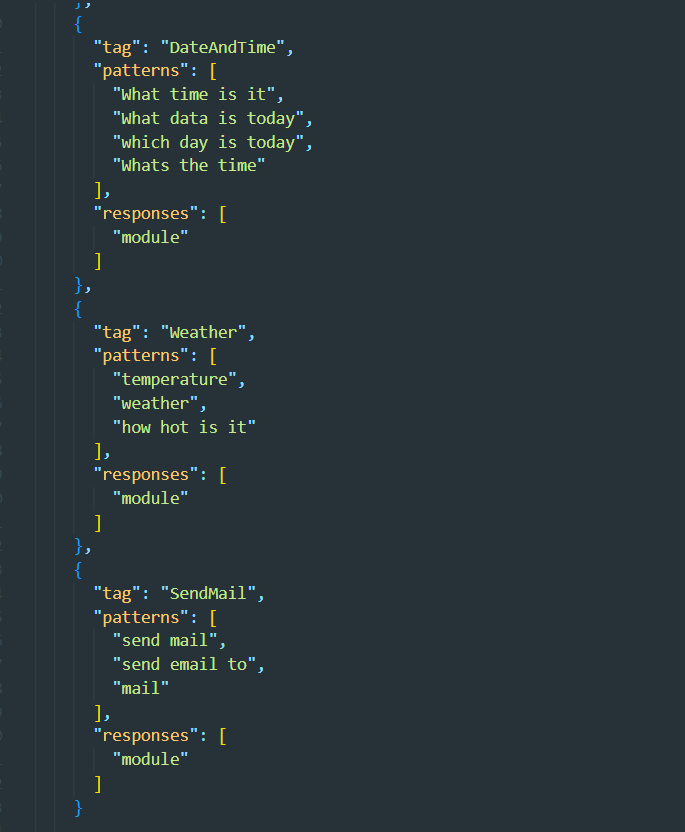

# CustomAi Assistant
This is a customizable Ai Assistant which uses Artificial Neural Networks(ANN) based Intent recognition to recognize the intent of user input.
You can customize its responses and you can defines modules to automate tasks for your personal use.

* ## Video tutorial :- (Comming Soon...)
<!---[](link)</br>-->

* ## How to use :-
  * Clone the repository
  ```shell
  git clone git@github.com:sanjaybora04/CustomAiAssistant.git
  ```
  * Build virtual environment (Optional)
  ```shell
  python -m venv env
  ```
  now activate the environment
  ```shell
  source env/bin/activate         //for Linux
  source env/scripts/activate     //for Windows (using git bash)
  ```
  * Install required modules using "requirements.txt"
  ```shell
  pip install -r requirements.txt
  ```
  * Now your Ai Assistant is ready to use
  * Now run "tryassistant.py" to chat with your assistant.
    >You can add voice recognition by modifying "tryassistant.py",</br>
    > and you can run it as service to make it run automatically when you start your device
---
  
* ## Configuration (if you want to customize the Assistant) :- 
  * ### For customising responses :-
    * To customise responses for assistant "assistant/intent.json" has to be modified.</br>
    </br>
    * **Tag** :- Please use a different tag for each of your intents 
    * **Pattern** :- You can enter multiple patterns and the model will be trained based on that.
    * **Responses** :- You can enter multiple responses and responses will be chosen randomely from the list.

    * After you have configured intents.json just run train.py from chatbot folder and the training process will start
    * After training is finished your assistant is all set to rock!!

  * ### For customising modules :-
    
    * For adding custom modules first you have to configure intents.json as mentioned(but inside responses you have to enter "module" to use the command to fire a module) as shown in image below</br>
    </br>
    * Now make a python file inside "assistant/modules" named same as the tag you entered in the intent. **For Example** :- In the above image for DateAndTime intent you have to make a file named "DateAndTime.py" inside the module folder
    * Now as shown in image below make function reply() in your module and return the string you want the AI to give as response.</br>
    </br>
    * The returned string will be returned by the chatbot as a response and you can also perform other tasks in the function such as playing music, opening apps ,etc as well</br>
    </br>
    As you can see in this module a song is being played and "Playing song.mp3" is returned as a string
    * Lets take one more example of a module that repeats what you said:-</br>
    
    >Note: Don't forget to run train.py each time you make any change to "intents.json"
